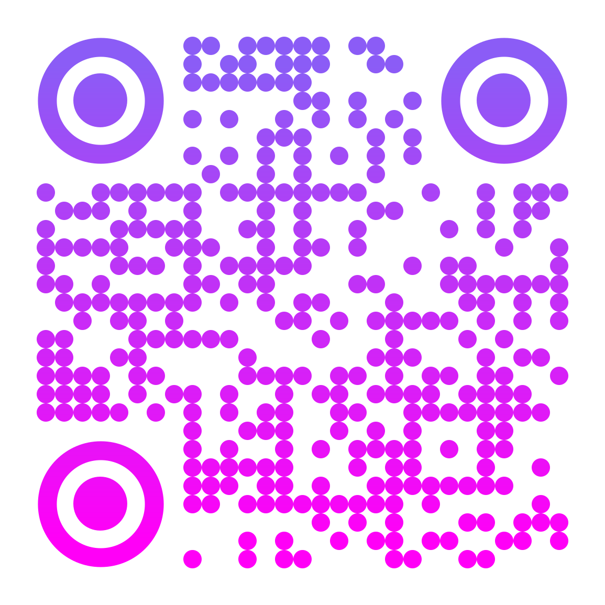

# Beam

Beam is a minimalist web app that allows users to share text or links with mobile devices via QR codes or direct URLs.

## Features

- Share text or links instantly with QR codes.
- Save and generate direct URLs for easy sharing.
- Responsive and user-friendly interface.

## Usage

Visit the live app at [beam.mauriziocarella.it](https://beam.mauriziocarella.it).

1. **Enter Content**: Type the text or paste the link you want to share.
2. **Generate QR Code**: The app will automatically generate a QR code for the input.
3. **Share via URL**: Save the content and get a direct URL to share with others.

## License

This project is licensed under the MIT License. See the [LICENSE](LICENSE) file for details.

---

Built with ❤️ by [Maurizio Carella](https://mauriziocarella.it).
